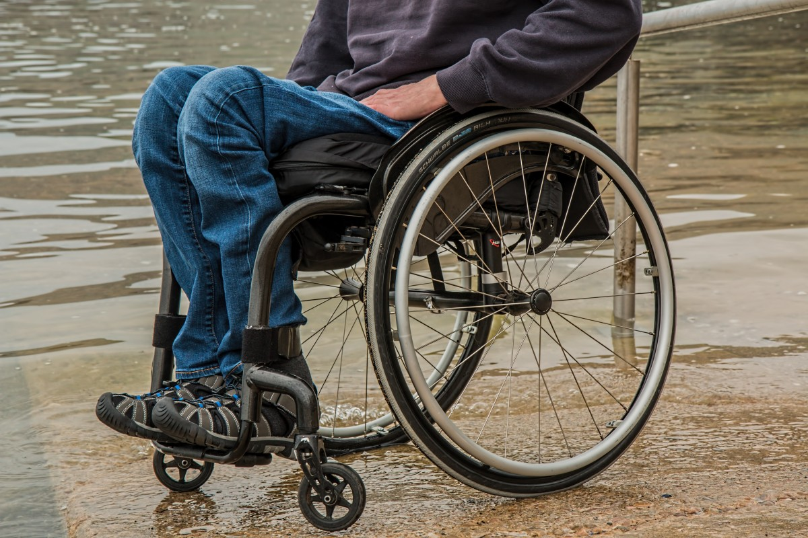

<!DOCTYPE html>
<html lang="en-US">
    <head>
        <link rel="stylesheet", type="text/css", href="navigation.css">
        <link rel="stylesheet", type="text/css", href="content.css">
        
        
        <title>Home - AIPAL</title>
    </head>
    <body>
        

            

                <b>AIPAL</b>
                <ul>
                    <li><a href="#home">Home</a></li>
                    <li><a href="#problem">Problem</a></li>
                    <li><a href="#solution">Solution</a></li>
                    <li><a href="#evaluation">Evaluation</a></li>
                    <li><a href="#reference">Reference</a></li>
                </ul>
                <button type="button" 
                        title="print current webpage"onclick="window.print()">
                    
                </button>
                <button type="button" 
                        title="search within the website" onclick="toSearch()">
                    
                </button>
            

        

        

            
            
            
        

        

            
            
        

        

            

                <h1>ARTIFICIAL INTELLIGENCE POWERED ARTIFICIAL LIMB (AIPAL)</h1>
                

                    An effective AI solution for amputation patients
                

            

        

        

            
            

                <h2>Problem</h2>
                
Millions of amputation patients need more flexible pathetic limb

            

        

        

            

                <h2>Solution</h2>
                
An AI powered artificial alternative

            

            
        

        

            
            

                <h2>Evaluation</h2>
                
An Ethnic, safe, sustainable and practical approach

            

        

    </body>
</html>
